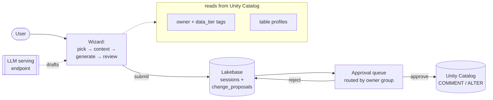
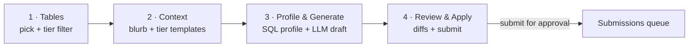
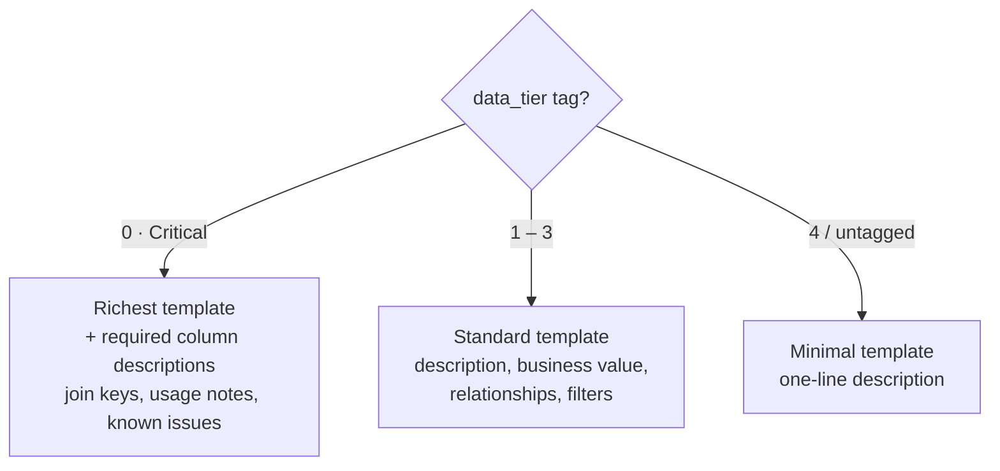
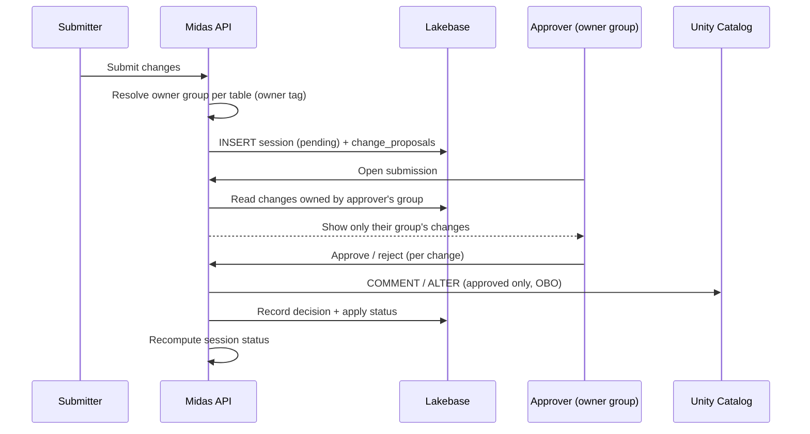
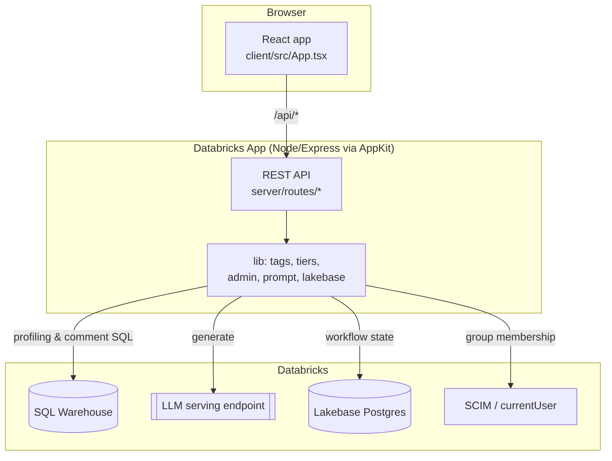
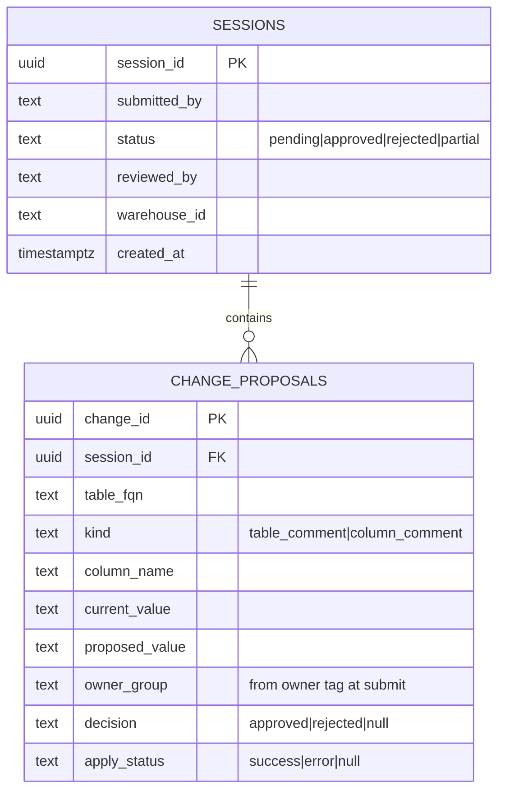

# Midas v2 — AI Metadata Generator for Unity Catalog

Midas helps data teams write good, **Genie-optimized** metadata (table & column
comments) for Unity Catalog tables — at scale, with an AI assist and a
governance-aware **approval workflow**.

You pick tables, add a little context, let a model draft descriptions tuned to
each table's **data tier**, review the before/after diffs, and submit them for
approval. Approvals are routed to the group that **owns** each table, and only
approved changes are written back to Unity Catalog.

Built on [Databricks AppKit](https://databricks.com), it runs as a Databricks
App with a React front end, an Express API, and a Lakebase (Postgres) store for
the approval workflow.

---

## Table of contents

- [What it does](#what-it-does)
- [How it works (the big picture)](#how-it-works-the-big-picture)
- [The 4-step wizard](#the-4-step-wizard)
- [Data tiers (DAWG 0003)](#data-tiers-dawg-0003)
- [The approval workflow](#the-approval-workflow)
- [Architecture](#architecture)
- [Data model](#data-model)
- [Getting started](#getting-started)
- [Configuration](#configuration)
- [Project layout](#project-layout)
- [API reference](#api-reference)

---

## What it does

| | |
|---|---|
| 🔎 **Browse & filter tables** | Pick tables by catalog / schema, search, or filter by **data tier** (incl. untagged / non-tiered). |
| 🧠 **Tier-aware generation** | Profiles each table (row counts, distinct values, samples) and asks an LLM to write comments using the template for that table's tier. |
| 👀 **Review with diffs** | See a word-level before/after diff of every comment, edit anything, and check it against its tier's DAWG 0003 requirements. |
| ✅ **Governed approvals** | Submit changes for review; they route to the table's **owner group**. Approvers only see and act on the tables they own. |
| ✍️ **Safe apply** | Only **approved** changes are written to Unity Catalog via `COMMENT` / `ALTER TABLE`, on-behalf-of the reviewer. |

---

## How it works (the big picture)



**Two systems of record:**

- **Lakebase (Postgres)** — the app's own database. Stores the *approval
  workflow*: who proposed what, who approved it, and the outcome.
- **Unity Catalog** — the real metadata target. Tags (`owner`, `data_tier`) are
  *read* from here; approved comments are *written* back here.

Everything runs **on-behalf-of the signed-in user** — profiling SQL uses their
warehouse, generation uses their token, and approvals apply with their
permissions. Users only ever touch data they're authorized for.

---

## The 4-step wizard



1. **Tables** — Browse by catalog/schema, search, or filter by data tier.
   Each row shows its tier badge and owner group.
2. **Context** — Add an optional business blurb, and optionally edit the
   per-tier generation templates. *Each table is generated with the structure
   for its data tier.*
3. **Profile & Generate** — Runs 3 profiling SQL queries per table, then calls
   the LLM once per table with a tier-specific prompt. Results persist if you
   navigate away, and a banner warns if your selection/context drifts.
4. **Review & Apply** — Word-level before/after diffs, inline editing, a DAWG
   0003 requirements checklist per tier, then **Submit for approval**.

---

## Data tiers (DAWG 0003)

A table's tier comes from its governed **`data_tier`** tag (`0`–`4`). The tier
decides **how rich the generated metadata is** — it's applied at *generation*
time, not at apply time. Untagged tables fall back to **Tier 4**.



| Tier | Label | Structure | Column descriptions |
|------|-------|-----------|---------------------|
| 0 | Critical | Richest — business value, join keys, usage notes, known issues, event trigger | **Required** |
| 1–3 | Standard | Description, business value, key relationships, filters/segments | Optional |
| 4 | Non-Tiered | Minimal — single general description | Optional |

> The tier templates are editable per-run in the **Context** step, and their
> defaults live in [`shared/tiers.ts`](shared/tiers.ts) (the single source of
> truth for prompts, the review checklist, and badges).

---

## The approval workflow

When you submit, each proposed change is stamped with its table's **owner
group** (from the `owner` tag) and written to Lakebase as a `pending` session.



**Key rules:**

- **Authority is per-change**, gated on the change's `owner_group`.
  - Workspace **admins** and an optional **override group** can decide anything.
  - Otherwise you can only decide changes owned by a group you belong to.
  - **Untagged** changes (no owner) → admins / override only.
- **Visibility mirrors authority.** A group approver sees *only* the tables
  their group owns — even in a mixed-owner batch. Admins/override and the
  submitter see the whole batch.
- **Mixed-owner batches are jointly reviewed.** If a submission spans
  `payments_team` and `risk_team` tables, each team decides its own changes;
  the session stays `pending` until every change is decided.
- **Status roll-up:** `approved` (all approved & applied cleanly) ·
  `rejected` (all rejected) · `partial` (mixed or any apply error) · else
  `pending`.

Membership is resolved via an on-behalf-of SCIM `currentUser.me()` call and
cached 5 minutes per user. Owner-tag values must match a **workspace group
display name** (case-insensitive) for routing to work.

---

## Architecture



- **Frontend:** React 19 + Vite, a single-page wizard (`client/src/App.tsx`).
- **Backend:** Express routes registered through AppKit (`server/server.ts`).
- **Auth:** on-behalf-of the user via `X-Forwarded-*` headers → a per-request
  `WorkspaceClient`.
- **Storage:** Lakebase Postgres, auto-provisioned on first boot (schema
  `midas`), authenticated with short-lived OAuth tokens.

---

## Data model



Both tables live in schema `midas` in Lakebase and are created/migrated
automatically on startup ([`server/lib/lakebase.ts`](server/lib/lakebase.ts)).

---

## Getting started

### Prerequisites

- Node.js 20+
- A Databricks workspace with: a SQL warehouse, a model serving endpoint, and a
  Lakebase database instance.
- The [Databricks CLI](https://docs.databricks.com/dev-tools/cli/) authenticated
  to your workspace (a profile, e.g. `midas`).

### Local development

```bash
npm install
cp .env.example .env      # fill in host, warehouse id, etc.
npm run dev               # tsx watch + Vite, hot reload
```

### Build & deploy (Databricks Apps)

```bash
npm run build                     # build client + server
node scripts/build-deploy.js      # assemble the .deploy/ payload
databricks bundle deploy -p midas # upload the bundle (internal dev target)
databricks bundle run app -p midas# (re)start the app
```

The app is defined in [`databricks.yml`](databricks.yml) (app resource,
Lakebase instance, serving endpoint, and OAuth scopes).

### Deploying to a customer workspace

The bundle ships two targets:

| Target | Host | Use |
|---|---|---|
| `default` | `fevm-midas` (hardcoded) | Internal Midas dev workspace |
| `customer` | from the CLI profile / `DATABRICKS_HOST` | Any customer workspace |

Two things are parameterized for a customer deploy:

- **Workspace host** — comes from the Databricks CLI **profile** (`-p`) or the
  `DATABRICKS_HOST` env var. It is *not* a bundle variable: the CLI forbids
  variable interpolation on `workspace.host` because that field configures
  authentication.
- **Lakebase instance name** — the `lakebase_instance` bundle variable
  (default `midasv2-lakebase`), passed with `--var`. It's the single source of
  truth: it names both the Lakebase instance the bundle **provisions** and the
  runtime `LAKEBASE_INSTANCE_NAME` the app uses to mint OAuth DB credentials, so
  the two can never drift.

```bash
# Build the payload first
npm run build
node scripts/build-deploy.js

# Deploy with a customer CLI profile
databricks bundle deploy -t customer -p <customer-profile> \
  --var="lakebase_instance=<instance-name>"
databricks bundle run app -t customer -p <customer-profile>
```

Or, without a configured profile:

```bash
export DATABRICKS_HOST=https://<customer>.cloud.databricks.com
export DATABRICKS_TOKEN=<token>
databricks bundle deploy -t customer --var="lakebase_instance=<instance-name>"
```

This provisions a **dedicated** Lakebase instance (`CU_1`) under the given name
and deploys the app against it. On first boot the app creates the `app_db`
database, the `midas` schema, and its tables automatically.

> **Prerequisites in the customer workspace:** Lakebase must be enabled, and the
> serving endpoint named in [`databricks.yml`](databricks.yml)
> (`databricks-gpt-5-4` by default) must exist — change that name if the
> workspace uses a different LLM endpoint.

### Useful scripts

| Command | What it does |
|---|---|
| `npm run dev` | Local dev server with hot reload |
| `npm run build` | Build server + client bundles |
| `npm run typecheck` | Type-check both projects |
| `npm run lint` / `lint:fix` | ESLint |
| `npm test` | Unit + smoke tests |
| `npm run test:e2e` | Playwright end-to-end tests |

---

## Configuration

Set via `.env` locally or the app's environment in Databricks.

| Variable | Default | Purpose |
|---|---|---|
| `DATABRICKS_HOST` | — | Workspace URL (used for OBO clients & serving) |
| `DATABRICKS_WAREHOUSE_ID` | — | Default warehouse for profiling / SQL |
| `DATABRICKS_SERVING_ENDPOINT_NAME` | `databricks-gpt-5-4` | LLM used for generation |
| `MIDAS_OWNER_TAG_KEY` | `owner` | Governed-tag key whose value is the owning group (approval routing) |
| `MIDAS_TIER_TAG_KEY` | `data_tier` | Governed-tag key whose value is the DAWG 0002 tier (0–4) |
| `MIDAS_ADMIN_OVERRIDE` | — | Optional group that may approve **any** change (admins always can) |

---

## Project layout

```
midasv2/
├── client/src/
│   ├── App.tsx            # the whole wizard + submissions UI
│   └── lib/{api,diff}.ts  # API client, word-level diff
├── server/
│   ├── server.ts          # AppKit entry — registers all routes
│   ├── routes/
│   │   ├── catalog.ts     # catalogs, schemas, tables, tag filters
│   │   ├── profiling.ts   # per-table profiling SQL
│   │   ├── metadata.ts    # LLM generation
│   │   ├── sessions.ts    # approval workflow (submit/list/decide)
│   │   ├── apply.ts        # direct apply / undo
│   │   └── genie.ts        # Genie room helpers
│   └── lib/
│       ├── tags.ts        # owner + tier tag lookups
│       ├── admin.ts       # group membership + approval authority
│       ├── prompt.ts      # tier-aware prompt construction
│       └── lakebase.ts    # Postgres pool + schema bootstrap
├── shared/tiers.ts        # DAWG 0003 tier specs (single source of truth)
└── databricks.yml         # app bundle definition
```

---

## API reference

All endpoints are under `/api` and run on-behalf-of the caller.

**Catalog & discovery**
- `GET /api/catalog/catalogs · /schemas · /all-tables` — browse, with
  `tiers=` filtering and paging
- `GET /api/catalog/tags` · `POST /api/catalog/tables-by-tags` — governed-tag filtering
- `POST /api/catalog/tables/hydrate` · `check-permissions`

**Generate**
- `POST /api/profiling/profile` — profile tables (row counts, distinct, samples)
- `POST /api/metadata/generate` — draft comments per table, tier-aware

**Approval workflow**
- `POST /api/sessions` — submit a batch (creates a `pending` session)
- `GET /api/sessions` — list (queue / mine), scoped to the caller
- `GET /api/sessions/:id` — one session, changes filtered to the caller's groups
- `POST /api/sessions/:id/decide` — per-change approve/reject (+ apply to UC)
- `POST /api/sessions/:id/resubmit` · `PATCH .../changes/:changeId` · `DELETE .../:id`
- `GET /api/me/role` — identity, admin status, groups, `can_approve`

---

<sub>Built with Databricks AppKit · React · Express · Lakebase.</sub>
